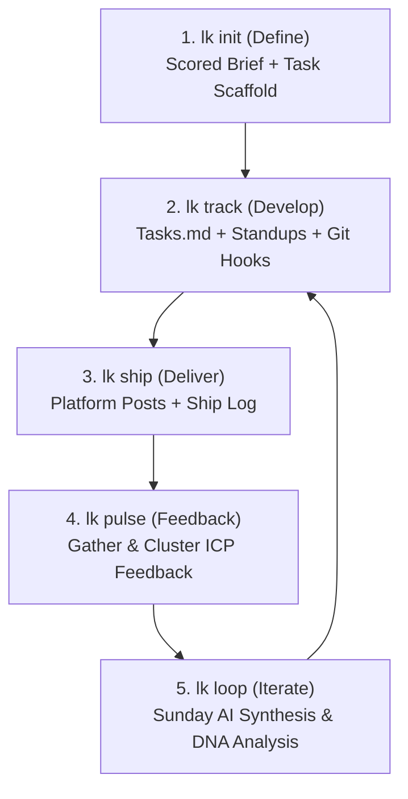
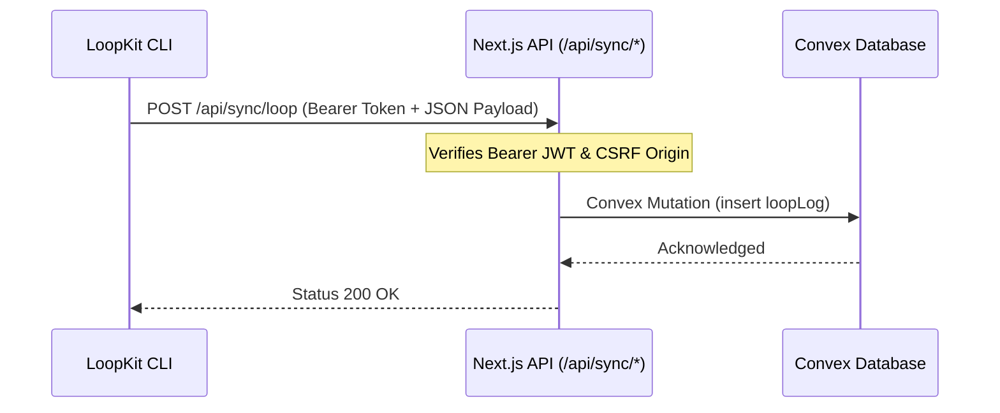

# AGENTS.md — LoopKit Master Guide & Agentic Guidelines

This document serves as the absolute single source of truth for any developer or AI agent working on **LoopKit**. It provides a comprehensive reference covering the product concept, monorepo architecture, CLI command workflows, data schemas, Convex synchronization, analytics engine logic, and safety protocols.

> [!NOTE]
> Read [CLAUDE.md](file:///Users/bharath/Desktop/on-going-projects/loopkit/CLAUDE.md) for toolchain commands and daily workflow tips. This file focuses on the product specifications and coding guidelines.

---

## 1. Product Architecture & Concept

LoopKit is a CLI-first habit-forming productivity workspace designed specifically for solo technical founders. It centers around a weekly execution loop to build shipping consistency.



### The Product Hierarchy
- **The Core Loop (Define → Develop → Deliver → Feedback → Iterate):** Commands driving the weekly habit: `init`, `track`, `ship`, `pulse`, and `loop`.
- **Secondary Intelligence Tools:** Supporting utilities to reduce friction, track metrics, and guide strategy without replacing the weekly focus: `radar`, `keywords`, `timing`, `coach`, `revenue`, `celebrate`, `auth`, `telemetry`, `remind`, and `aliases`.

---

## 2. CLI Command Specifications

LoopKit has exactly **15 commands**. Do not add new top-level commands without explicit approval. All CLI command UI is built around `@clack/prompts` and our custom `clog` facade.

### Core Loop Commands

#### 1. `init [name]`
- **Purpose**: Creates a scored, falsifiable brief and task scaffold for a new project.
- **Flags**:
  - `-t, --template <id>`: Specifies a project template (`saas`, `api`, `mobile`, `cli`, `newsletter`, `agency`, `open-source`, `marketplace`, `ai-wrapper`).
  - `--cron`: Installs a Friday reminder cron job.
  - `--validate`: Triggers the Devil's Advocate validator.
  - `--analyze <name>`: Runs AI analysis on a saved session.
- **Workflow**: Prompts for Project Name, Problem, ICP, Why Unsolved, and MVP. Runs AI scoring (1–10) on ICP, Problem, and MVP. If `--validate` is passed, asks 3 hard validating questions to stress-test the concept. If a template is chosen, calls AI to customize the task scaffold. Writes `brief.md`, `brief.json`, and `tasks.md`.

#### 2. `track`
- **Purpose**: Displays the status of the weekly checklist and backlog from `tasks.md`.
- **Flags**:
  - `-s, --stand`: Triggers a 60-second standup check-in. Logs the task of the day.
  - `-w, --week`: Renders the current week's summary card, including completed tasks and snoozed vs cut totals.
  - `-a, --add [title]`: Adds a new task. If no title is provided, opens `$EDITOR` to write it.
  - `-r, --repair`: Scans and re-sequences task IDs sequentially (e.g. `[1]`, `[2]`, `[3]`).
  - `-p, --project <slug>`: Switches the active project context in config.
- **Workflow**: Parses `tasks.md` using regex. Displays tasks in two categories: "Weekly Commitments" and "Backlog". Monitors git commits to automatically transition task states using the post-commit git hook. Warns when snoozing tasks based on oracle metrics.

#### 3. `ship`
- **Purpose**: AI generates launch copy drafts for Hacker News, Twitter (thread), and Indie Hackers.
- **Workflow**: Reads `brief.json` and recent completed tasks. Invokes the AI generator. Offers the user interactive actions per draft: View, Edit (in `$EDITOR`), Copy, or Regenerate. Writes to `ships/YYYY-MM-DD.md` and syncs to Convex.

#### 4. `pulse`
- **Purpose**: Records and clusters customer feedback with AI to identify patterns.
- **Flags**:
  - `--add <text>`: Logs a feedback entry inline.
  - `--raw`: Displays a plain list of feedback entries without AI clustering.
  - `--setup`: Prints setup instructions for the feedback collection widget.
  - `--share`: Generates a feedback submission URL and outputs a QR code.
- **Workflow**: Gathers feedback from `.loopkit/pulse/responses.json` (and syncs from Convex). Invokes AI to categorize feedback into three buckets: `Fix now` (critical friction), `Validate later` (feature ideas), and `Noise`.

#### 5. `loop`
- **Purpose**: Sunday ritual command. Synthesizes the week's accomplishments and challenges.
- **Flags**:
  - `--revenue <amount>`: Logs MRR inline during the loop ritual.
  - `--async`: Allows completing the loop on any day of the week within a 7-day grace window without breaking streaks.
- **Workflow**: Compares tasks completed vs total. Prompts for the week's main win, the "one thing" holding the project back, a rationale, and tensions. Generates a build-in-public (BIP) post using AI. Evaluates override reasons if the founder manually alters their shipping score. Computes the streak and runs analytics detectors (DNA, Churn, Oracle, Churn Guardian, Success Predictor).

---

### Secondary Commands

| Command | Purpose | Options / Flags | Key Details |
| --- | --- | --- | --- |
| `revenue` | MRR progress tracker. | `-a, --add <amount>`<br>`-l, --log` | Stores MRR entries. Renders text-based timeline graphs. |
| `radar` | Scans launches in category. | `-c, --category <name>`<br>`-p, --project <slug>` | Scans Hacker News and Product Hunt RSS feeds. |
| `keywords` | Niche SEO discovery. | `-c, --category <name>`<br>`-p, --project <slug>` | Scans Google Autocomplete, Reddit API, and GitHub. |
| `timing` | Market indicators. | `-c, --category <name>`<br>`-p, --project <slug>` | Evaluates funding rounds, hiring trends, and star counts. |
| `coach` | Intervenes on patterns. | `--on`<br>`--off`<br>`--dna` | Triggers coaching cards. `--dna` yields the Founder DNA. |
| `celebrate` | Visual completion celebration. | `--share` | ASCII confetti and score cards. `--share` sends win to loopkit.dev/wins. |
| `auth` | Account credentials. | `--key <api_key>` | Browser OAuth flow. `--key` allows pasting a direct Anthropic key. |
| `aliases` | Installs CLI abbreviations. | `--remove` | Configures shell shortcuts: `lk`, `lks`, `lkt`, and `lkl`. |
| `remind:friday` | Standard reminder check. | None | Local system daemon trigger for the Friday check-in. |
| `telemetry` | Data collection settings. | `[action]` (`on`/`off`/`export`/`delete`) | Configures anonymized data collection. |

---

## 3. Monorepo & Directory Structure

```
loopkit/
├── packages/
│   ├── shared/            # @loopkit/shared: Types, Zod schemas, common helpers
│   │   ├── src/
│   │   │   └── index.ts   # Single source of truth for all schemas
│   │   └── package.json
│   │
│   ├── cli/               # loopkit: CLI codebase
│   │   ├── src/
│   │   │   ├── index.ts   # Entry point using Commander.js
│   │   │   ├── commands/  # Commander subcommands
│   │   │   ├── analytics/ # DNA, score, benchmarks, predictor, oracle
│   │   │   ├── ai/        # Structured AI generation client & prompts
│   │   │   ├── storage/   # Local .loopkit and Convex sync sync operations
│   │   │   └── ui/        # Terminal theme, layouts, and ceremony
│   │   └── package.json
│   │
│   └── web/               # @loopkit/web: Next.js frontend application
│       ├── src/app/       # Pages: dashboard, radar, timing, keywords, pulse
│       ├── convex/        # Convex backend functions, schemas, and queries
│       └── package.json
│
├── prd.md                 # Product Requirements Document
├── STATUS.md              # Feature completion map and roadmap status
└── tsconfig.json          # Root typescript config
```

---

## 4. Local Storage Folder Map

User data is written to a local `.loopkit/` directory in the project workspace. 

```
.loopkit/
├── config.json                  ← ConfigSchema: Active project, credentials, prefs, telemetry
├── projects/
│   └── [project-slug]/
│       ├── brief.json           ← BriefSchema: Project definition and AI score
│       ├── brief.md             ← Readable project brief document
│       ├── draft.json           ← Cached session questions for init resume
│       ├── tasks.md             ← plain text task list parsed by track.ts
│       └── cut.md               ← Archived cut tasks (append-only)
├── ships/
│   └── YYYY-MM-DD.md            ← ShipLogSchema: Weekly launches and drafts
├── logs/
│   └── week-N.md                ← LoopLogSchema: Weekly synthesis and BIP posts
├── cache/
│   └── [sha256-hash].json       ← Cached AI responses (7-day TTL)
├── telemetry/
│   └── week-N.json              ← TelemetryEventSchema: Anonymized event logs
└── pulse/
    └── responses.json           ← PulseResponseSchema: feedback responses list
```

### Path Resolvers (`packages/cli/src/storage/local.ts`)
Always resolve workspace file locations using these helpers. Never hardcode the `.loopkit` prefix.
- `getRoot()`: Resolves Process CWD + `.loopkit`.
- `getConfigPath()`: Resolves `getRoot() / config.json`.
- `getProjectDir(slug)`: Resolves project storage directory.
- `getTasksPath(slug)`: Resolves `tasks.md` path.
- `getShipLogPath(date)`: Resolves ship log markdown file.
- `getLoopLogPath(weekNum)`: Resolves week-N loop log file.

---

## 5. Convex Backend & Syncing Architecture

LoopKit CLI syncs local progress to Convex to populate the user's web dashboard. Synchronization payloads are routed from `packages/cli/src/storage/sync.ts` through authenticated Next.js API endpoints.

### Sync Endpoints & Payloads



#### Sync Payload Definitions:
1. **Loop Log (`/api/sync/loop`)**: Pushes shipping scores, tasks completed, weekly synthesis (win, oneThing, tension), and proof metrics.
2. **Ship Log (`/api/sync/ship`)**: Pushes date, launch descriptions, checklists (readme, landing page), and AI-generated copy.
3. **Radar Scan (`/api/sync/radar`)**: Syncs category-matched Hacker News and Product Hunt competitor launches.
4. **Timing Signal (`/api/sync/timing`)**: Syncs composite score, funding trends, dev growth, and hiring count.
5. **Milestone trigger (`/api/sync/milestone`)**: Emits system milestones (e.g. first task, first ship, streak reached).
6. **Public Win (`/api/sync/win`)**: Posts weekly achievements to the public feed at `loopkit.dev/wins`.

---

## 6. Shared Schema Registry

All schemas are located in [packages/shared/src/index.ts](file:///Users/bharath/Desktop/on-going-projects/loopkit/packages/shared/src/index.ts). Below are the primary Zod schemas used to validate data:

```typescript
// 1. Brief Schema (Saved inside projects/[slug]/brief.json)
export const BriefSchema = z.object({
  bet: z.string(),
  uncomfortableTruth: z.string(),
  icpScore: z.number().min(1).max(10),
  icpNote: z.string(),
  problemScore: z.number().min(1).max(10),
  problemNote: z.string(),
  mvpScore: z.number().min(1).max(10),
  mvpNote: z.string(),
  overallScore: z.number().min(1).max(10),
  riskiestAssumption: z.string(),
  validateAction: z.string(),
  mvpPlainEnglish: z.string(),
});

// 2. Task Schema (Representing a line in tasks.md)
export const TaskStatus = z.enum(["open", "done", "snoozed", "cut"]);
export const TaskSchema = z.object({
  id: z.number(),
  title: z.string(),
  status: TaskStatus,
  createdAt: z.string(),
  closedAt: z.string().optional(),
  closedVia: z.string().optional(), // commit SHA
  snoozedUntil: z.string().optional(),
  section: z.enum(["week", "backlog"]),
});

// 3. Loop Log Schema (Saved inside logs/week-N.md as JSON block)
export const LoopSynthesisSchema = z.object({
  weekWin: z.string(),
  oneThing: z.string(),
  rationale: z.string(),
  tension: z.string().nullable(),
  bipPost: z.string(),
  founderNote: z.string(),
});
export const LoopLogSchema = z.object({
  weekNumber: z.number(),
  date: z.string(),
  tasksCompleted: z.number(),
  tasksTotal: z.number(),
  shippingScore: z.number(),
  synthesis: LoopSynthesisSchema.optional(),
  overridden: z.boolean().default(false),
  overrideReason: z.string().optional(),
  bipPost: z.string().optional(),
  proof: z.object({
    previousScore: z.number(),
    currentScore: z.number(),
    scoreDelta: z.number(),
    weeksActive: z.number(),
    decisionsMade: z.number(),
    feedbackResponses: z.number(),
    feedbackActedOn: z.boolean(),
  }).optional(),
});

// 4. Config Schema (Saved inside config.json)
export const ConfigSchema = z.object({
  version: z.number().default(1),
  activeProject: z.string().optional(),
  distinctId: z.string().optional(),
  encryptionSalt: z.string().optional(),
  anthropicKey: z.string().optional(),
  auth: z.object({ apiKey: z.string().optional() }).optional(),
  preferences: z.object({
    defaultEditor: z.string().optional(),
    autoOpenDashboard: z.boolean().default(true),
  }).optional(),
  telemetry: z.object({
    optedIn: z.boolean().default(false),
    prompted: z.boolean().default(false),
    promptWeek: z.number().optional(),
  }).optional(),
  coaching: z.object({
    enabled: z.boolean().default(true),
    lastShownMomentId: z.string().optional(),
    lastShownAt: z.string().optional(),
  }).optional(),
  aliasesInstalled: z.boolean().optional(),
  referralShown: z.boolean().optional(),
  referralCode: z.string().optional(),
});
```

---

## 7. Analytics & Intelligence Engines

LoopKit provides tailored metrics, warnings, and strategies through its intelligence modules located in `packages/cli/src/analytics/`.

### Intelligence Modules & Mechanics

#### 1. Shipping DNA (`dna.ts`)
- **Archetypes**: Determines a founder's profile after 4 weeks of loops:
  - **All-Star**: Consistency $\ge 85\%$ and streak $\ge 4$ weeks.
  - **Marathoner**: High task completion, steady velocity, long streaks.
  - **Sprinter**: Burst completion followed by low activity weeks.
  - **Perfectionist**: High score but low task throughput (low velocity).
  - **Reactor**: Driven by external feedback; highly volatile completion style.
- **DNA Report (`coach --dna`)**: Renders streaks, peak days, velocity trend, and a monthly AI-synthesized coaching recommendation based on the profile.

#### 2. LoopKit Score (`score.ts`)
- **Vanity Metric Formula**: Calculates a score (0–100) combining weekly completion velocity, active streak multiplier, and customer feedback responsiveness:
  $$\text{Score} = \left( \text{Completion Velocity} \times 0.6 \right) + \left( \text{Streak Bonus} \times 0.2 \right) + \left( \text{Feedback Responsiveness} \times 0.2 \right)$$

#### 3. Churn Guardian (`churn.ts`)
- **Indicators**: Warns user when detecting:
  - Declining weekly scores for 2+ consecutive weeks.
  - Skipped loops (active streaks reset to 0).
  - High manual override rates of the weekly score ($\ge 50\%$).
- **Action**: Outputs warning blocks with specific steps to reduce scope and rebuild consistency.

#### 4. Auto-Loop (`autoLoop.ts`)
- **Missed Sunday Detector**: Detects when a user boots up on Monday/Tuesday without running `loop` on Sunday. Automatically drafts a weekly summary from local git history and logged task completions, prompting a one-click confirmation.

#### 5. Success Predictor (`predictor.ts`)
- **Heuristic Revenue Probability**: Evaluates probability of hitting first revenue within 6 months after 8 weeks of data. Analyzes consistency trends, task scope creep, override history, and feedback responsiveness.

#### 6. Snooze Oracle (`oracle.ts`)
- **Mechanics**: Checks task snooze history. When a user attempts to snooze a task in `track`, counts how many times it was already snoozed. If historical completion rate for snoozed tasks is below 30%, warns: *"X% of previously snoozed tasks were eventually cut. Consider deleting this task instead."*

#### 7. AI Coach (`coach.ts` & `patterns.ts`)
- **Coaching Moments**: Analyzes local records to trigger rule-based coaching interventions (e.g. "Overplanner" pattern when backlog grows $3\times$ faster than completion rate; "Ship Avoider" when tasks are finished but `ship` is never run).

---

## 8. Security & Integrity Protocols

> [!IMPORTANT]
> The integrity of user workspaces and security of API tokens are of paramount importance. Never violate these safety boundaries.

### 1. Token Encryption Routine
API tokens and keys are encrypted on disk inside `config.json`. The CLI derives an AES-256-GCM encryption key from host hardware identifiers and a localized salt.
- Salt is written to `config.json` on initialization.
- Key material uses: `os.hostname() + os.userInfo().username + salt`.
- Plaintext keys must never be written directly to disk.

### 2. Append-Only Git Hooks
The post-commit git hook installation in `track.ts` must always be append-only. Overwriting `.git/hooks/commit-msg` is strictly forbidden, as it corrupts developer environments.
```typescript
// CORRECT append-only implementation
const hookLine = `\n# ── LoopKit ──\nnode .git/hooks/loopkit-commit-msg.js "$1"\n`;
const existing = fs.existsSync(hookPath) ? fs.readFileSync(hookPath, "utf-8") : "#!/bin/sh\n";
if (!existing.includes("loopkit-commit-msg.js")) {
  fs.writeFileSync(hookPath, existing + hookLine);
}
```

### 3. Graceful Exit on Interrupt (`Ctrl+C`)
Every interactive `@clack/prompts` query must be checked for the cancellation sentinel immediately. When cancellation is detected, output a clean exit message without printing stack traces.
```typescript
const answer = await text({ message: "What is your ICP?" });
if (isCancel(answer)) {
  ceremonyOutro("Cancelled.");
  process.exit(0);
}
```

### 4. AI Fail-Safes
If network calls or AI services fail, the CLI must fallback to localized heuristics.
- **Init Failures**: Ask 3 basic text prompts and write task scaffolds using hardcoded template defaults.
- **Loop Synthesis Failures**: Output local task completion statistics and generate a generic text BIP draft.
- **Radar/Timing Failures**: Display cached entries or generic category insights.

---

## 9. UI Design System & Aesthetics Guidelines

LoopKit is built with a bespoke, highly refined terminal UI. Avoid plain output. Always frame interactive flows and reports within beautiful borders.

### UI Tokens & Styles
- **Harmonious Palette**: Use HSL tailored terminal color exports from `ui/theme.ts`.
  - Primary: Violet (`#7C3AED`)
  - Secondary: Cyan (`#06B6D4`)
  - Success: Emerald (`#10B981`)
  - Warning: Amber (`#F59E0B`)
  - Danger: Red (`#EF4444`)
  - Muted: Zinc/Gray (`#6B7280`)
- **Ceremony Borders**:
  - All multi-step commands begin with `ceremonyIntro(title)` and end with `ceremonyOutro(footer)`.
  - Do not use `console.log()` inside ceremony frames. Use the `clog` facade (`clog.success()`, `clog.info()`, `clog.warn()`, `clog.error()`, `clog.step()`, `clog.message()`) which automatically appends clack-compatible vertical border prefix lines (`│`).
- **Data Layout Components**:
  - `box()`: Renders double-lined borders around cards and launch text.
  - `table()`: Renders formatted matrix layouts.
  - `progressBar()` / `scoreBar()`: Renders block character progress indicators.

---

## 10. Development & Verification Lifecycle

Before committing any feature or declaring a task complete, run the following verification steps:

```bash
# 1. Compile schemas (shared package first)
pnpm --filter @loopkit/shared build

# 2. Compile CLI application
pnpm --filter @loopkit/cli build

# 3. Verify help commands route correctly
node packages/cli/dist/index.js --help

# 4. Verify test suites
pnpm --filter @loopkit/shared test
pnpm --filter @loopkit/cli test
pnpm --filter @loopkit/web test
```

### Definition of Done Checklist
- [ ] Code compiles without errors (0 TypeScript issues).
- [ ] Schema changes are mapped in `packages/shared/src/index.ts` and built first.
- [ ] Commands handle `p.isCancel()` at every stage.
- [ ] Console logs are formatted using the `clog` facade or ceremony blocks.
- [ ] Local storage write failures are handled gracefully.
- [ ] Synchronization requests include fallback timeouts and error catching.
- [ ] Core business rules (such as 15 command cap) are strictly obeyed.
